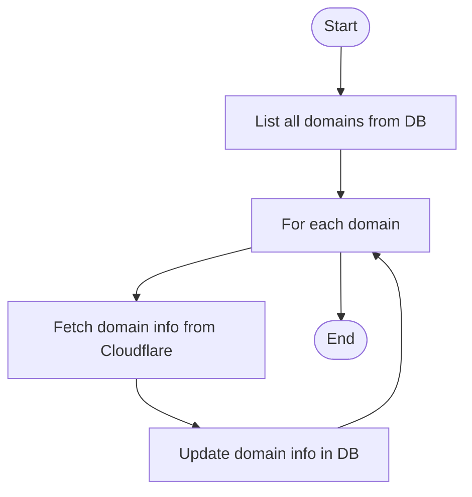
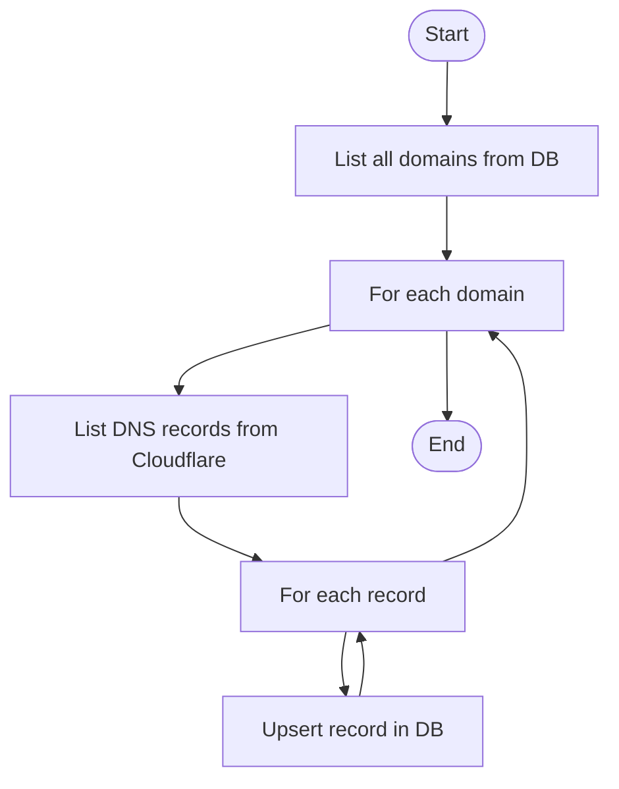
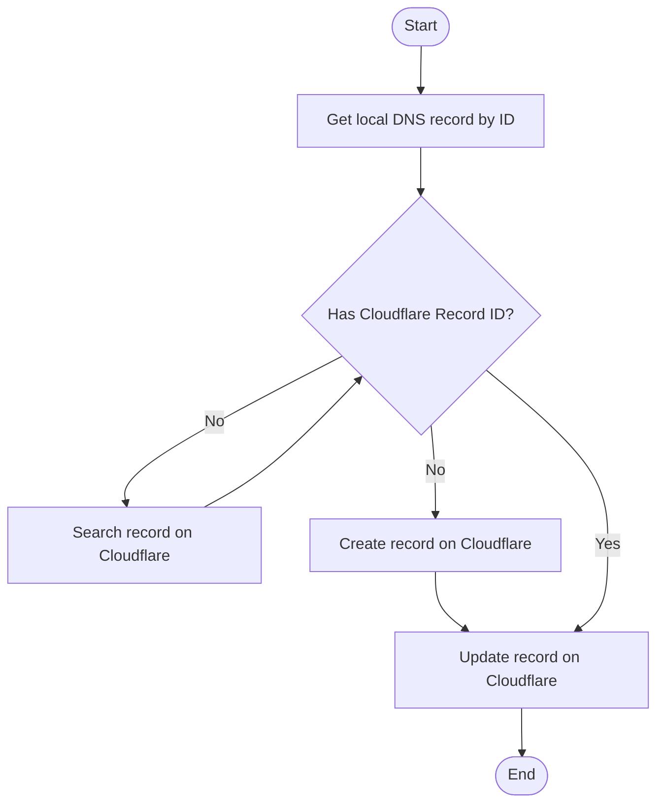
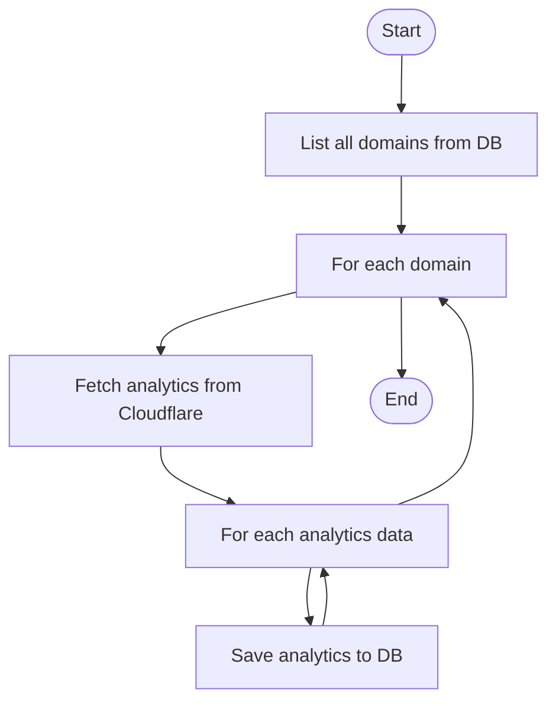

# Workflow: Cloudflare DNS Bundle

This document illustrates the main workflows of the Cloudflare DNS Bundle using Mermaid diagrams.

## 1. Domain Info Sync

## 2. DNS Record Sync (Cloudflare -> Local)

## 3. DNS Record Sync (Local -> Cloudflare)

## 4. DNS Analytics Sync

## Notes

- All workflows are triggered via CLI commands or service methods.
- Error handling and logging are present at each step.
- Batch operations are supported for efficiency.
