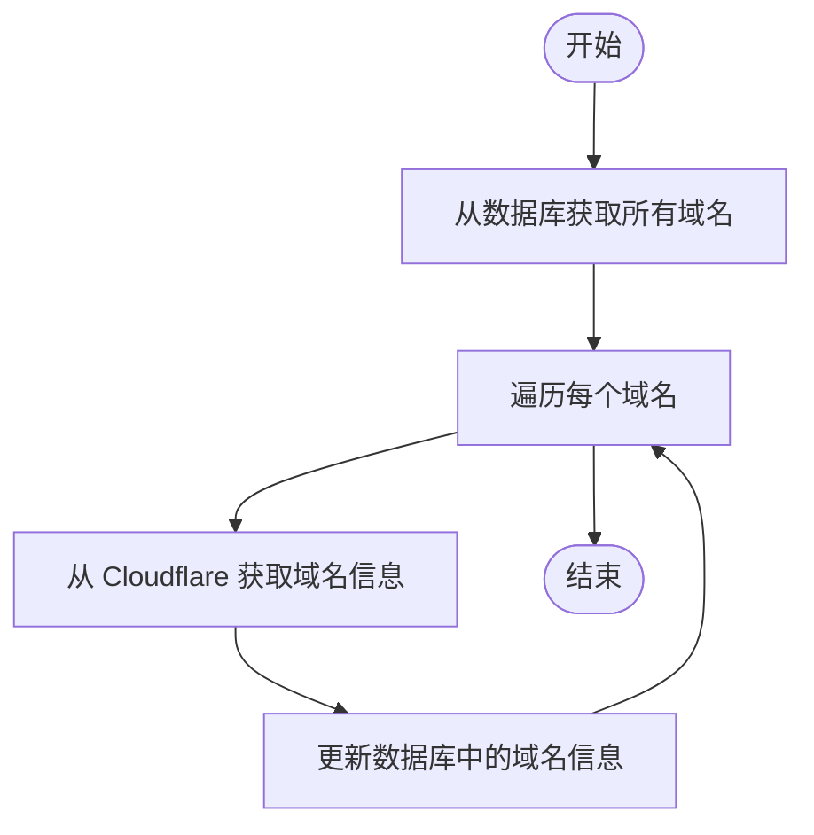
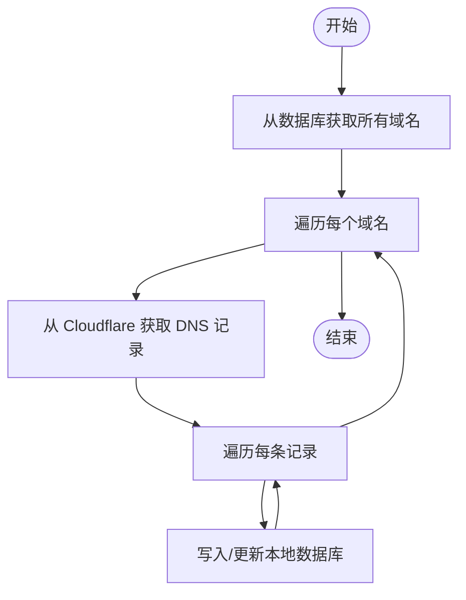
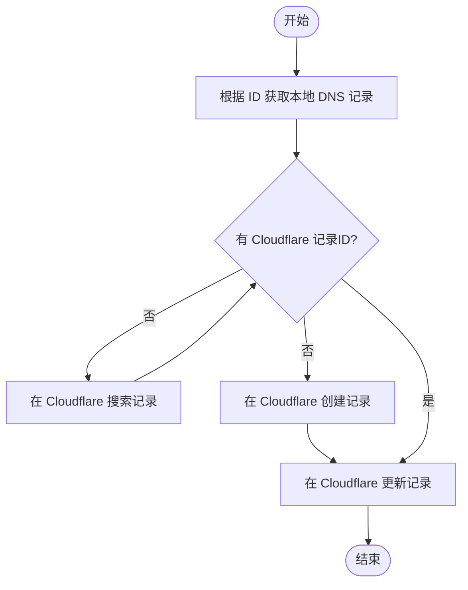
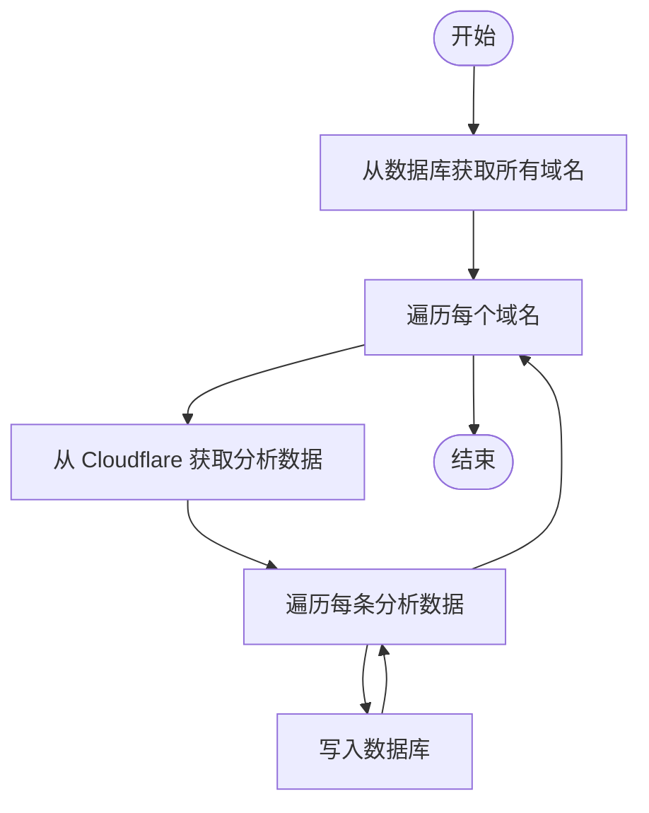

# 工作流说明：Cloudflare DNS Bundle

本文档通过 Mermaid 流程图展示 Cloudflare DNS Bundle 的主要工作流。

## 1. 域名信息同步

## 2. DNS 记录同步（Cloudflare -> 本地）

## 3. DNS 记录同步（本地 -> Cloudflare）

## 4. DNS 分析数据同步

## 说明

- 所有工作流均可通过命令行或服务方法触发。
- 每一步均有错误处理和日志记录。
- 支持批量操作以提升效率。
